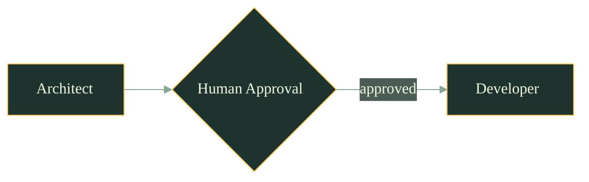

# Amelia Dark Theme for Mermaid

Use this frontmatter in your Mermaid diagrams:

```yaml
---
config:
  theme: base
  themeVariables:
    primaryColor: "#1F332E"
    primaryTextColor: "#EFF8E2"
    primaryBorderColor: "#FFC857"
    secondaryColor: "#4A5C54"
    tertiaryColor: "#0D1A12"
    lineColor: "#88A896"
    fontFamily: "Source Sans 3"
---
```

Or use init directive:
```
%%{init: { "theme": "base", "themeVariables": { "primaryColor": "#1F332E", "primaryTextColor": "#EFF8E2", "primaryBorderColor": "#FFC857", "secondaryColor": "#4A5C54", "tertiaryColor": "#0D1A12", "lineColor": "#88A896", "fontFamily": "Source Sans 3" } } }%%
```

## Example


