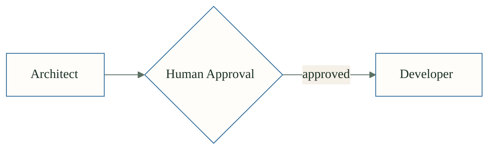

# Amelia Light Theme for Mermaid

Use this frontmatter in your Mermaid diagrams:

```yaml
---
config:
  theme: base
  themeVariables:
    primaryColor: "#FFFDF9"
    primaryTextColor: "#1A2F23"
    primaryBorderColor: "#2E6B9C"
    secondaryColor: "#F5F0E8"
    tertiaryColor: "#FDF8F0"
    lineColor: "#5C7263"
    fontFamily: "Source Sans 3"
---
```

Or use init directive:
```
%%{init: { "theme": "base", "themeVariables": { "primaryColor": "#FFFDF9", "primaryTextColor": "#1A2F23", "primaryBorderColor": "#2E6B9C", "secondaryColor": "#F5F0E8", "tertiaryColor": "#FDF8F0", "lineColor": "#5C7263", "fontFamily": "Source Sans 3" } } }%%
```

## Example


