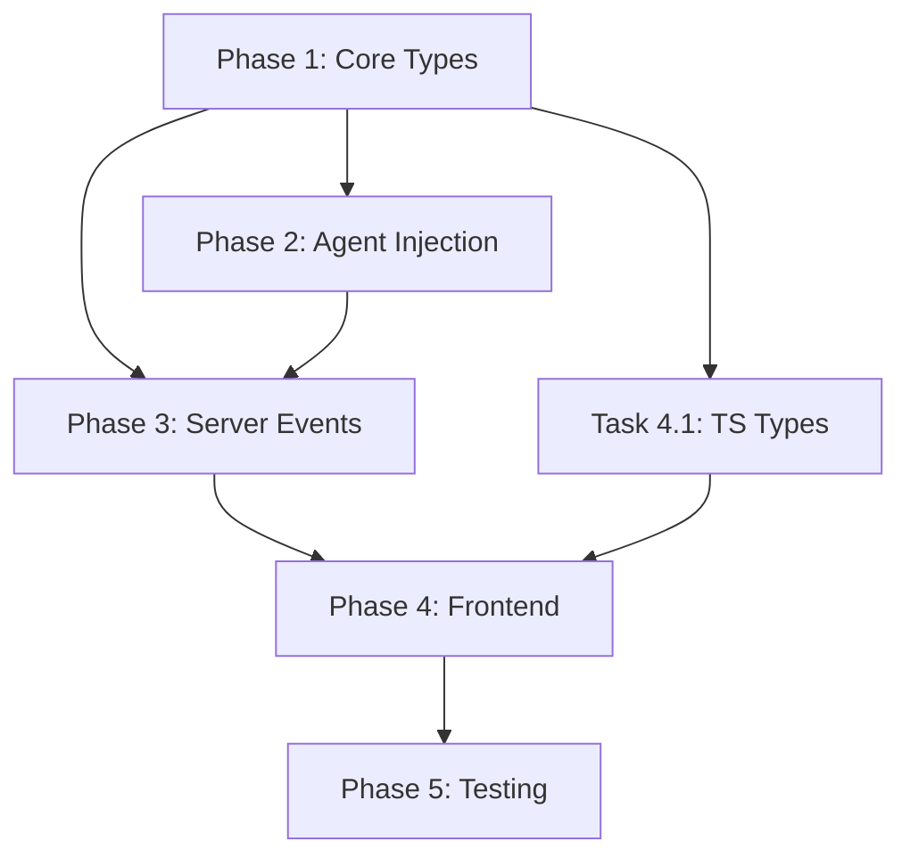

# Claude Code Streaming Output - Implementation Plan

> Implementation plan for [Issue #82](https://github.com/ka/amelia/issues/82): Real-time Claude Code streaming output in dashboard

## Current State Analysis

### What Already Exists

| Component | Status | Location |
|-----------|--------|----------|
| CLI driver stream events | Exists | `amelia/drivers/cli/claude.py:60-127` |
| Developer stream handler | Exists (terminal only) | `amelia/agents/developer.py:204-224` |
| Developer agentic execution | Exists | `amelia/agents/developer.py:167-202` |
| EventType enum | Exists | `amelia/server/models/events.py:12-58` |
| WorkflowEvent model | Exists | `amelia/server/models/events.py:61-110` |
| OrchestratorService._emit | Exists | `amelia/server/orchestrator/service.py:491-552` |
| useWebSocket hook | Exists | `dashboard/src/hooks/useWebSocket.ts:73-253` |
| LogsPage placeholder | Exists | `dashboard/src/pages/LogsPage.tsx:23-42` |

### What Needs to Be Created

| Component | Priority | Complexity |
|-----------|----------|------------|
| StreamEvent/StreamEventType types | High | Low |
| StreamEmitter type alias | High | Low |
| ClaudeStreamEvent → StreamEvent conversion | High | Low |
| Agent emitter injection (all 3 agents) | High | Medium |
| STREAM WebSocket event type | High | Low |
| Stream store (Zustand) | High | Medium |
| LogsPage implementation | High | Medium |
| Activity log live mode toggle | Medium | Medium |
| Unit tests | High | Medium |

---

## Implementation Phases

### Phase 1: Backend Core Types

Add streaming event types to the core types module.

#### Task 1.1: Add StreamEventType and StreamEvent to core types

**File: `amelia/core/types.py`**

Add:
```python
class StreamEventType(StrEnum):
    """Types of streaming events from Claude Code."""
    CLAUDE_THINKING = "claude_thinking"
    CLAUDE_TOOL_CALL = "claude_tool_call"
    CLAUDE_TOOL_RESULT = "claude_tool_result"
    AGENT_OUTPUT = "agent_output"


class StreamEvent(BaseModel):
    """Real-time streaming event from agent execution."""
    type: StreamEventType
    content: str | None = None
    timestamp: datetime
    agent: str  # "architect", "developer", "reviewer"
    workflow_id: str
    tool_name: str | None = None
    tool_input: dict[str, Any] | None = None


StreamEmitter = Callable[[StreamEvent], Awaitable[None]]
```

**Acceptance criteria:**
- [ ] StreamEventType enum with 4 event types
- [ ] StreamEvent Pydantic model with all fields
- [ ] StreamEmitter type alias defined
- [ ] Exports added to `__init__.py`
- [ ] Unit test for StreamEvent validation

---

#### Task 1.2: Add conversion helper to CLI driver

**File: `amelia/drivers/cli/claude.py`**

Add function to convert `ClaudeStreamEvent` to `StreamEvent`:

```python
def convert_to_stream_event(
    event: ClaudeStreamEvent,
    agent: str,
    workflow_id: str,
) -> StreamEvent | None:
    """Convert CLI driver event to unified StreamEvent.

    Args:
        event: Raw event from Claude CLI.
        agent: Agent name ("developer", "architect", "reviewer").
        workflow_id: Current workflow ID.

    Returns:
        Converted StreamEvent, or None for events to skip.
    """
    type_mapping = {
        "assistant": StreamEventType.CLAUDE_THINKING,
        "tool_use": StreamEventType.CLAUDE_TOOL_CALL,
        "result": StreamEventType.CLAUDE_TOOL_RESULT,
    }

    stream_type = type_mapping.get(event.type)
    if stream_type is None:
        return None  # Skip error/system events for now

    return StreamEvent(
        type=stream_type,
        content=event.content,
        timestamp=datetime.now(UTC),
        agent=agent,
        workflow_id=workflow_id,
        tool_name=event.tool_name,
        tool_input=event.tool_input,
    )
```

**Acceptance criteria:**
- [ ] Function handles all ClaudeStreamEventType values
- [ ] Correct type mapping (assistant→thinking, tool_use→tool_call, result→tool_result)
- [ ] Returns None for error/system events
- [ ] Unit tests for conversion logic

---

### Phase 2: Agent Emitter Injection

Modify all three agents to accept and use an optional stream emitter.

#### Task 2.1: Add emitter to Developer agent

**File: `amelia/agents/developer.py`**

Modify `__init__`:
```python
def __init__(
    self,
    driver: DriverInterface,
    execution_mode: ExecutionMode = "structured",
    stream_emitter: StreamEmitter | None = None,
):
    self.driver = driver
    self.execution_mode = execution_mode
    self._stream_emitter = stream_emitter
```

Modify `_handle_stream_event`:
```python
def _handle_stream_event(self, event: Any, workflow_id: str) -> None:
    """Display streaming event to terminal and emit via callback."""
    # Existing terminal display logic...

    # Emit via callback if configured
    if self._stream_emitter is not None:
        stream_event = convert_to_stream_event(event, "developer", workflow_id)
        if stream_event is not None:
            asyncio.create_task(self._stream_emitter(stream_event))
```

Update `_execute_agentic` to pass workflow_id to handler.

**Acceptance criteria:**
- [ ] Constructor accepts optional stream_emitter parameter
- [ ] _handle_stream_event emits via callback when configured
- [ ] Backward compatible (CLI usage without server works)
- [ ] Unit test for emitter invocation

---

#### Task 2.2: Add emitter to Architect agent

**File: `amelia/agents/architect.py`**

Modify `__init__`:
```python
def __init__(
    self,
    driver: DriverInterface,
    stream_emitter: StreamEmitter | None = None,
):
    self.driver = driver
    self._stream_emitter = stream_emitter
```

Modify `plan` method to emit AGENT_OUTPUT after completion:
```python
async def plan(self, state: ExecutionState) -> PlanOutput:
    # Existing plan logic...
    result = await self._generate_task_dag(state)

    # Emit completion event
    if self._stream_emitter is not None:
        event = StreamEvent(
            type=StreamEventType.AGENT_OUTPUT,
            content=f"Generated plan with {len(result.tasks)} tasks",
            timestamp=datetime.now(UTC),
            agent="architect",
            workflow_id=state.workflow_id,
        )
        await self._stream_emitter(event)

    return result
```

**Acceptance criteria:**
- [ ] Constructor accepts optional stream_emitter parameter
- [ ] Emits single AGENT_OUTPUT event after plan generation
- [ ] Backward compatible
- [ ] Unit test for emitter invocation

---

#### Task 2.3: Add emitter to Reviewer agent

**File: `amelia/agents/reviewer.py`**

Same pattern as Architect - emit AGENT_OUTPUT after review completion.

**Acceptance criteria:**
- [ ] Constructor accepts optional stream_emitter parameter
- [ ] Emits single AGENT_OUTPUT event after review completion
- [ ] Backward compatible
- [ ] Unit test for emitter invocation

---

### Phase 3: Server Event Propagation

Wire up emitters in the orchestrator service.

#### Task 3.1: Add STREAM event type to server models

**File: `amelia/server/models/events.py`**

Add to EventType enum:
```python
# Streaming (ephemeral, not persisted)
STREAM = "stream"
```

Add StreamEventPayload model:
```python
class StreamEventPayload(BaseModel):
    """Payload for STREAM WebSocket events."""
    subtype: StreamEventType
    content: str | None = None
    agent: str
    workflow_id: str
    timestamp: datetime
    tool_name: str | None = None
    tool_input: dict[str, Any] | None = None
```

**Acceptance criteria:**
- [ ] STREAM added to EventType enum
- [ ] StreamEventPayload model defined
- [ ] Unit test for model validation

---

#### Task 3.2: Create emitter factory in OrchestratorService

**File: `amelia/server/orchestrator/service.py`**

Add method to create emitter callbacks:
```python
def _create_stream_emitter(self, workflow_id: str) -> StreamEmitter:
    """Create a stream emitter callback for the given workflow.

    Stream events are broadcast via WebSocket but NOT persisted to the database.
    """
    async def emit(event: StreamEvent) -> None:
        # Broadcast to WebSocket clients only (no persistence)
        self._event_bus.emit_stream(event)

    return emit
```

Inject emitters when creating agents in `_run_workflow`:
```python
emitter = self._create_stream_emitter(workflow_id)
developer = Developer(driver, execution_mode, stream_emitter=emitter)
architect = Architect(driver, stream_emitter=emitter)
reviewer = Reviewer(driver, stream_emitter=emitter)
```

**Acceptance criteria:**
- [ ] Emitter factory method created
- [ ] Emitters injected into all agents during workflow creation
- [ ] Stream events NOT persisted to database
- [ ] Integration test for end-to-end propagation

---

#### Task 3.3: Add emit_stream to EventBus

**File: `amelia/server/events/bus.py`** (or wherever EventBus is defined)

Add method for ephemeral stream events:
```python
def emit_stream(self, event: StreamEvent) -> None:
    """Emit a stream event to all subscribers without persistence."""
    # Broadcast to WebSocket handlers
    ...
```

**Acceptance criteria:**
- [ ] emit_stream method added to EventBus
- [ ] Stream events broadcast without persistence
- [ ] WebSocket handler receives stream events

---

### Phase 4: Frontend Implementation

Implement the dashboard components for displaying stream events.

#### Task 4.1: Add TypeScript types for stream events

**File: `dashboard/src/types/index.ts`**

Add:
```typescript
export const StreamEventType = {
  CLAUDE_THINKING: 'claude_thinking',
  CLAUDE_TOOL_CALL: 'claude_tool_call',
  CLAUDE_TOOL_RESULT: 'claude_tool_result',
  AGENT_OUTPUT: 'agent_output',
} as const;

export type StreamEventType = typeof StreamEventType[keyof typeof StreamEventType];

export interface StreamEvent {
  type: StreamEventType;
  content: string | null;
  timestamp: string;
  agent: string;
  workflow_id: string;
  tool_name: string | null;
  tool_input: Record<string, unknown> | null;
}

// Update WebSocketMessage to include stream events
export type WebSocketMessage =
  | { type: 'event'; payload: WorkflowEvent }
  | { type: 'stream'; payload: StreamEvent }
  | { type: 'ping' }
  | { type: 'backfill_complete'; count: number }
  | { type: 'backfill_expired'; message: string };
```

**Acceptance criteria:**
- [ ] StreamEventType const object defined
- [ ] StreamEvent interface matches backend model
- [ ] WebSocketMessage union updated
- [ ] TypeScript compiles without errors

---

#### Task 4.2: Create stream store (Zustand)

**File: `dashboard/src/stores/stream-store.ts`** (new file)

```typescript
import { create } from 'zustand';
import type { StreamEvent } from '@/types';

interface StreamState {
  events: StreamEvent[];
  liveMode: boolean;
  maxEvents: number;

  // Actions
  addEvent: (event: StreamEvent) => void;
  setLiveMode: (enabled: boolean) => void;
  clearEvents: () => void;
}

export const useStreamStore = create<StreamState>((set) => ({
  events: [],
  liveMode: false,
  maxEvents: 1000,

  addEvent: (event) =>
    set((state) => ({
      events: [...state.events.slice(-state.maxEvents + 1), event],
    })),

  setLiveMode: (enabled) => set({ liveMode: enabled }),

  clearEvents: () => set({ events: [] }),
}));
```

**Acceptance criteria:**
- [ ] Zustand store created with events array
- [ ] liveMode toggle state
- [ ] Event buffer limits (maxEvents)
- [ ] Unit tests for store actions

---

#### Task 4.3: Update useWebSocket to handle stream events

**File: `dashboard/src/hooks/useWebSocket.ts`**

Add stream event handling to message handler:
```typescript
const addStreamEvent = useStreamStore((state) => state.addEvent);

// In message handler:
case 'stream':
  addStreamEvent(message.payload);
  break;
```

**Acceptance criteria:**
- [ ] Stream events dispatched to stream store
- [ ] No side effects for existing event handling
- [ ] Unit test for stream message handling

---

#### Task 4.4: Implement LogsPage

**File: `dashboard/src/pages/LogsPage.tsx`**

Replace placeholder with real-time log viewer:
- Display all stream events globally (across all workflows)
- Auto-scroll to bottom for new events
- Show event type icons, timestamps, agent badges
- Filter by event type and/or workflow

**Acceptance criteria:**
- [ ] Displays stream events from store
- [ ] Auto-scroll with "scroll to bottom" button
- [ ] Visual differentiation by event type
- [ ] Filter controls work correctly
- [ ] Empty state when no events
- [ ] Unit tests for component

---

#### Task 4.5: Add live mode toggle to activity log

**File: `dashboard/src/components/workflow/ActivityLog.tsx`** (or equivalent)

Add toggle button to show/hide stream events in workflow detail view:
- When enabled, interleave STREAM events with lifecycle events
- When disabled, show only lifecycle events (current behavior)

**Acceptance criteria:**
- [ ] Toggle button visible and functional
- [ ] Live mode shows stream events inline
- [ ] Toggle state persists during session
- [ ] Unit test for toggle behavior

---

### Phase 5: Testing & Polish

#### Task 5.1: Integration tests

**File: `tests/integration/test_stream_propagation.py`**

Test end-to-end flow:
1. Start workflow
2. Verify stream events emitted during developer execution
3. Verify events received via WebSocket
4. Verify events appear in dashboard store

**Acceptance criteria:**
- [ ] E2E test passes for developer streaming
- [ ] E2E test passes for architect output
- [ ] E2E test passes for reviewer output

---

#### Task 5.2: Frontend component tests

- Stream store unit tests (Vitest)
- LogsPage component tests
- useWebSocket stream handling tests

**Acceptance criteria:**
- [ ] All Vitest tests pass
- [ ] Test coverage for new components
- [ ] No regressions in existing tests

---

## Implementation Order & Dependencies



**Recommended order:**
1. **Phase 1** (Core Types) - Required first, provides types for everything else
2. **Task 4.1** (TS Types) - Can run in parallel with Phase 2, no backend dependency
3. **Phase 2** (Agent Injection) - Depends on Phase 1
4. **Phase 3** (Server Events) - Depends on Phases 1 & 2
5. **Task 4.2** (Stream Store) - Can start after Task 4.1
6. **Phase 4** (remaining frontend) - After Phase 3 complete
7. **Phase 5** (Testing) - After all features implemented

---

## Parallelization Opportunities

| Group | Tasks | Dependencies |
|-------|-------|--------------|
| **Backend Types** | 1.1, 1.2 | None |
| **Frontend Types** | 4.1 | None |
| **Agent Injection** | 2.1, 2.2, 2.3 | After Phase 1 |
| **Frontend Store** | 4.2, 4.3 | After 4.1 |
| **Frontend UI** | 4.4, 4.5 | After 4.2, 4.3 |

---

## Risk Assessment

| Risk | Impact | Mitigation |
|------|--------|------------|
| Event bus modification complexity | Medium | Keep emit_stream separate from existing emit |
| WebSocket message format changes | Medium | Version-tolerant frontend parsing |
| Performance with high event volume | Medium | Buffer limits, debouncing in frontend |
| Backward compatibility breaks | High | Optional emitter parameter, graceful degradation |

---

## Success Criteria

The streaming feature is complete when:

1. **Developer shows real-time output** - Tool calls and thinking visible in dashboard
2. **Architect/Reviewer show completion** - Single AGENT_OUTPUT event per invocation
3. **LogsPage is functional** - Global view of all stream events
4. **Activity log has live mode** - Toggle to see stream events inline
5. **No persistence** - Stream events are ephemeral (WebSocket only)
6. **Backward compatible** - CLI usage without server still works

---

## Estimated Scope

| Phase | Tasks | Estimated Files |
|-------|-------|-----------------|
| Phase 1 | 2 | 2 files |
| Phase 2 | 3 | 3 files |
| Phase 3 | 3 | 3 files |
| Phase 4 | 5 | 5 files |
| Phase 5 | 2 | 2 files |
| **Total** | **15** | **~15 files** |
