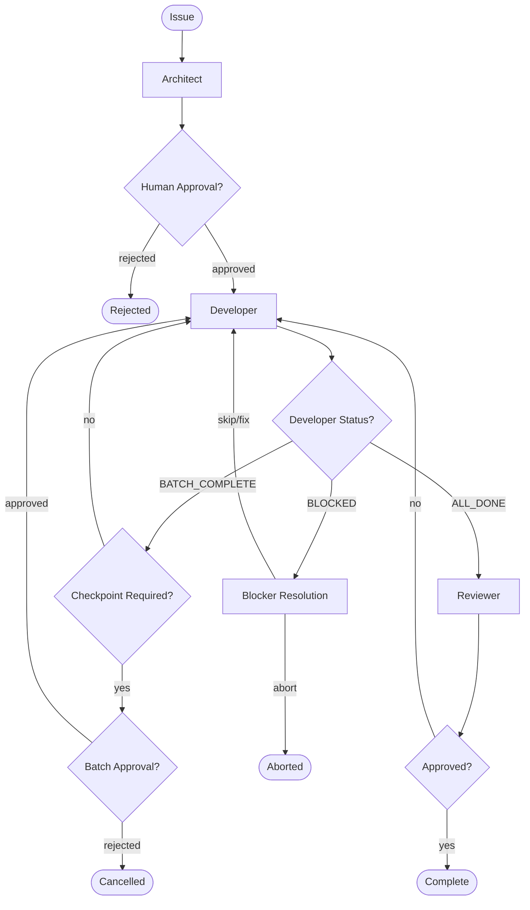

# Agentic AI Concepts

This document explains the core concepts behind Amelia's agentic architecture for engineers new to agentic AI systems.

## What is an "Agent"?

An agent is an LLM given a specific role, tools, and instructions. Unlike a chatbot that just responds to queries, an agent can take actions - executing commands, writing files, and making decisions.

Each agent has:
- **System prompt**: Defines its persona and capabilities
- **Tools**: Access to specific operations (shell commands, file operations)
- **Input/output schemas**: Structured communication with defined types

## Amelia's Agents

### Architect (`amelia/agents/architect.py`)

**Role**: Analyzes issues, designs solutions, creates execution plans.

| Property | Description |
|----------|-------------|
| Input | `Issue` (id, title, description) |
| Output | `ExecutionPlan` (batches of steps with dependencies) |
| Key Feature | Uses structured output to ensure parseable JSON with batched execution model |

The Architect examines an issue and breaks it down into discrete, actionable steps organized into batches. Each batch groups related work that executes before a checkpoint. This plan forms the foundation for the Developer's work.

**Note**: The Architect's `plan()` method accepts an optional `Design` parameter for incorporating design specifications from brainstorming sessions.

### Developer (`amelia/agents/developer.py`)

**Role**: Executes tasks by writing code and running commands.

| Capability | Description |
|------------|-------------|
| Shell commands | Execute terminal commands via `run_shell_command` tool |
| File writes | Create/modify files via `write_file` tool |
| LLM generation | Generate code or content for complex tasks |

Tasks are executed based on their descriptions. The Developer can work in parallel on independent tasks, speeding up execution.

**Execution Modes**:
- `structured` (default): Tasks executed as individual tool calls (shell commands, file writes)
- `agentic`: Full Claude tool access with streaming, autonomous execution

### Reviewer (`amelia/agents/reviewer.py`)

**Role**: Reviews code changes, provides feedback, approves or requests fixes.

**Strategies**:
- `single`: One general review covering all aspects
- `competitive`: Parallel reviews from Security, Performance, and Usability personas, then aggregated into final feedback

| Output | Description |
|--------|-------------|
| `approved` | Boolean - whether changes are acceptable |
| `comments` | Detailed feedback on the changes |
| `severity` | Issue severity (info, warning, error) |

### Tracker Factory (`amelia/trackers/factory.py`)

**Role**: Utility for creating the appropriate tracker based on profile configuration.

The `create_tracker()` factory function returns a `BaseTracker` implementation (Jira, GitHub, or Noop) based on the profile's `tracker` setting. Trackers are utilities that fetch issues, not agents.

## What is "Orchestration"?

Orchestration coordinates multiple agents through a workflow. Rather than one monolithic AI call, orchestration breaks work into specialized steps with clear handoffs.

Amelia uses **LangGraph's StateGraph** for orchestration:
- **Nodes**: Individual agent calls (architect, developer, reviewer)
- **Edges**: Transitions between nodes
- **Conditional edges**: Decision points (approved? tasks remaining?)

### State Machine



**ExecutionState** tracks everything:
- Current profile and issue
- Generated plan (ExecutionPlan with batches)
- Messages exchanged
- Approval status
- Review results
- `execution_plan`: ExecutionPlan with batches replacing simple task lists
- `current_batch_index`: Index of the batch being executed
- `batch_results`: Results from completed batches
- `developer_status`: Current Developer agent status (EXECUTING, BATCH_COMPLETE, BLOCKED, ALL_DONE)
- `current_blocker`: Active blocker report if execution is blocked
- `blocker_resolution`: Human's response to resolve blocker
- `batch_approvals`: Records of human approvals for batches
- `skipped_step_ids`: IDs of steps that were skipped
- `git_snapshot_before_batch`: Git state snapshot for potential revert
- `code_changes_for_review`: Staged code changes
- `driver_session_id`: For CLI driver session continuity
- `workflow_status`: Workflow lifecycle status

## Batched Execution Model

Amelia uses a batched execution model that groups related work into logical units with checkpoint opportunities. This enables better human oversight while maintaining efficient execution.

**ExecutionPlan** replaces simple task lists. It contains a sequence of **ExecutionBatch** objects, where each batch represents a group of related steps that execute before a checkpoint. This structure allows the Architect to define logical boundaries for human approval gates.

**PlanStep** is the atomic unit of work. Each step has:
- An `action_type` (code, command, validation, or manual)
- Validation criteria (expected exit codes, output patterns)
- A `risk_level` (low, medium, or high) that influences checkpoint behavior
- Dependencies on other steps
- Optional fallback commands for resilience

**Batches** have a `risk_summary` field that aggregates the risk level of all steps in the batch. This summary affects whether a checkpoint is required based on the configured trust level. The batched model provides predictable stopping points where humans can review progress and decide whether to continue.

For detailed implementation information, see the [Architecture Overview](overview.md#key-types).

## Trust Levels

Trust levels control how much autonomy the Developer agent has during execution. This is configured via `profile.trust_level` in your settings:

| Trust Level | Behavior | Use Case |
|-------------|----------|----------|
| **PARANOID** | Human approves every single batch | Maximum oversight, learning phase, high-risk changes |
| **STANDARD** (default) | Always checkpoint between batches | Balanced oversight and efficiency |
| **AUTONOMOUS** | Auto-approve low/medium risk batches, checkpoint only for high-risk | Trusted environments, routine tasks |

All trust levels still require human intervention when execution blocks with an error or unexpected state. The trust level only affects whether completed batches require approval before proceeding.

## Blocker Handling

Execution can block when the Developer encounters an issue it cannot resolve autonomously. When this happens, a **BlockerReport** is created that captures:

- The `step_id` and description of the blocked step
- A `blocker_type` indicating what went wrong
- The `error_message` with details about the failure
- `attempted_actions` the Developer already tried
- `suggested_resolutions` the Developer proposes for human consideration

**BlockerType** values include:
- `command_failed`: A shell command returned a non-zero exit code
- `validation_failed`: Output didn't match expected patterns
- `needs_judgment`: Requires human decision-making
- `unexpected_state`: System is in an unanticipated state
- `dependency_skipped`: A dependency was skipped, blocking this step
- `user_cancelled`: User explicitly cancelled execution

When blocked, humans can choose to:
- **Skip**: Skip the blocked step and continue (may cascade to dependent steps)
- **Retry**: Try the step again (possibly after manual fixes)
- **Abort**: Cancel the entire workflow

This blocker handling is core to the Developer execution flow, ensuring the system never gets stuck in an unrecoverable state.

## Tool Use

Agents don't just generate text - they call tools. This is what makes them "agentic."

### How Tool Calls Work

1. Agent receives task/context
2. Agent decides which tool to call with what parameters
3. Driver executes the tool
4. Result returns to agent for next decision

### Example Flow

```
Developer receives: "Create a new test file for user authentication"
    ↓
Developer calls: write_file(path="tests/test_auth.py", content="...")
    ↓
Driver executes the write
    ↓
Developer receives: "File created successfully"
    ↓
Developer marks task complete
```

### Available Tools

| Tool | Purpose |
|------|---------|
| `run_shell_command` | Execute terminal commands |
| `write_file` | Create or modify files |
| `read_file` | Read file contents |

## The Driver Abstraction

Drivers abstract how Amelia communicates with LLMs. This separation enables flexibility across different environments.

### Why Two Drivers?

| Driver | Use Case | Requirements |
|--------|----------|--------------|
| `api:openai` | Direct API calls, simple setup, fast prototyping | `OPENAI_API_KEY` env var |
| `cli:claude` | Enterprise-friendly, wraps authenticated CLI tools, policy-compliant | `claude` CLI installed |

### Driver Interface

Both drivers implement `DriverInterface`:

```python
class DriverInterface(Protocol):
    async def generate(
        self,
        messages: list,
        schema: type | None = None
    ) -> str | BaseModel:
        """Get LLM response, optionally with structured output."""
        ...

    async def execute_tool(
        self,
        tool_name: str,
        **kwargs
    ) -> str:
        """Execute a tool and return result."""
        ...

    async def execute_agentic(
        self,
        prompt: str,
        context: dict | None = None
    ) -> str:
        """Execute in agentic mode with full tool access."""
        ...
```

### Why This Matters

Enterprise environments often prohibit direct API calls due to data retention policies. The CLI driver wraps existing approved tools (like `claude` CLI) that:
- Inherit SSO authentication
- Comply with data policies
- Use existing security approvals

Users can switch between drivers without code changes - just update the profile.

## The Tracker Abstraction

Trackers provide pluggable backends for fetching issues.

| Tracker | Source | Requirements |
|---------|--------|--------------|
| `jira` | Jira issues | `JIRA_BASE_URL`, `JIRA_EMAIL`, `JIRA_API_TOKEN` |
| `github` | GitHub issues | `gh` CLI authenticated (`gh auth login`) |
| `noop` | Manual input | None |

All implement the `BaseTracker` protocol:

```python
class BaseTracker(Protocol):
    def get_issue(self, issue_id: str) -> Issue:
        """Fetch issue details by ID."""
        ...
```

This abstraction means Amelia works with any issue source without changing the core orchestration logic.

## Streaming

Amelia provides real-time updates to the dashboard through a streaming event system. **StreamEvent** objects are emitted during agent execution, allowing users to see progress as it happens.

**StreamEventType** defines the types of events:
- `CLAUDE_THINKING`: The LLM is analyzing and planning
- `CLAUDE_TOOL_CALL`: The LLM is calling a tool
- `CLAUDE_TOOL_RESULT`: Tool execution has completed with a result
- `AGENT_OUTPUT`: An agent has produced output

Each StreamEvent includes:
- The event type and content
- A timestamp for ordering
- The agent name (architect, developer, reviewer)
- The workflow ID for correlation
- Optional tool-specific fields (tool name, tool input)

This streaming capability enables the dashboard to show live progress without polling. For implementation details, see the [Architecture Overview](overview.md#websocket-events).

## Key Takeaways

1. **Agents are specialized**: Each has a focused role, leading to better outputs
2. **Orchestration provides structure**: State machine ensures consistent workflow
3. **Batched execution enables oversight**: Work is grouped into logical units with checkpoint opportunities
4. **Tools enable action**: Agents execute real changes, not just generate text
5. **Abstractions enable flexibility**: Drivers and trackers adapt to different environments
6. **Trust levels balance autonomy and control**: Configurable oversight from paranoid to autonomous
7. **Blocker handling ensures resilience**: System never gets stuck; humans can skip, retry, or abort
8. **Streaming enables real-time feedback**: Dashboard shows live progress without polling
