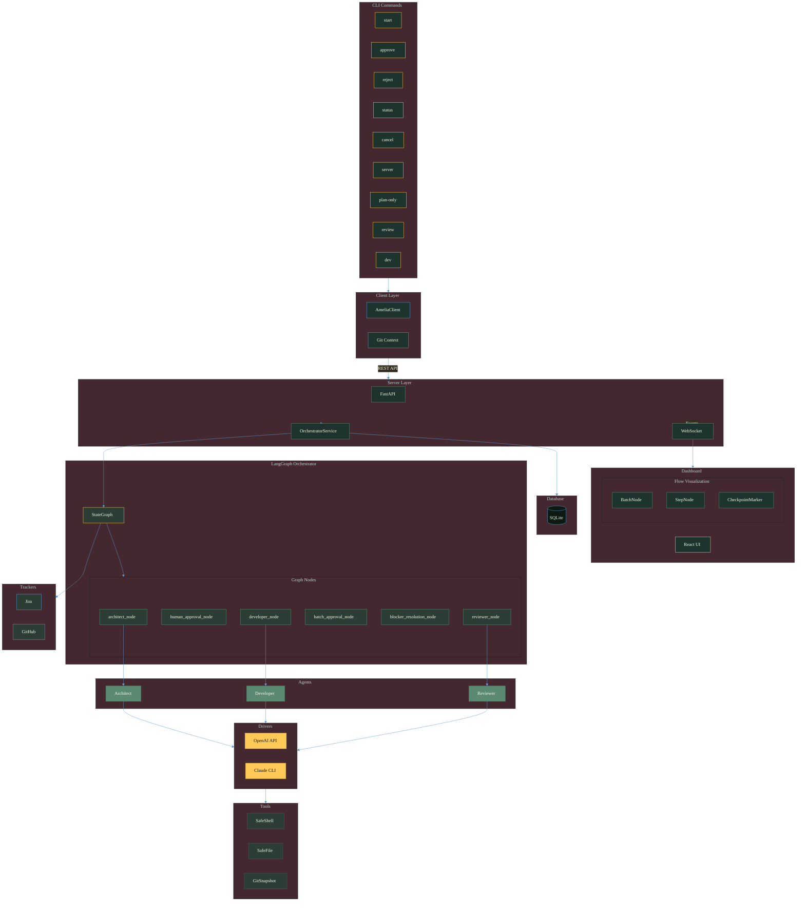
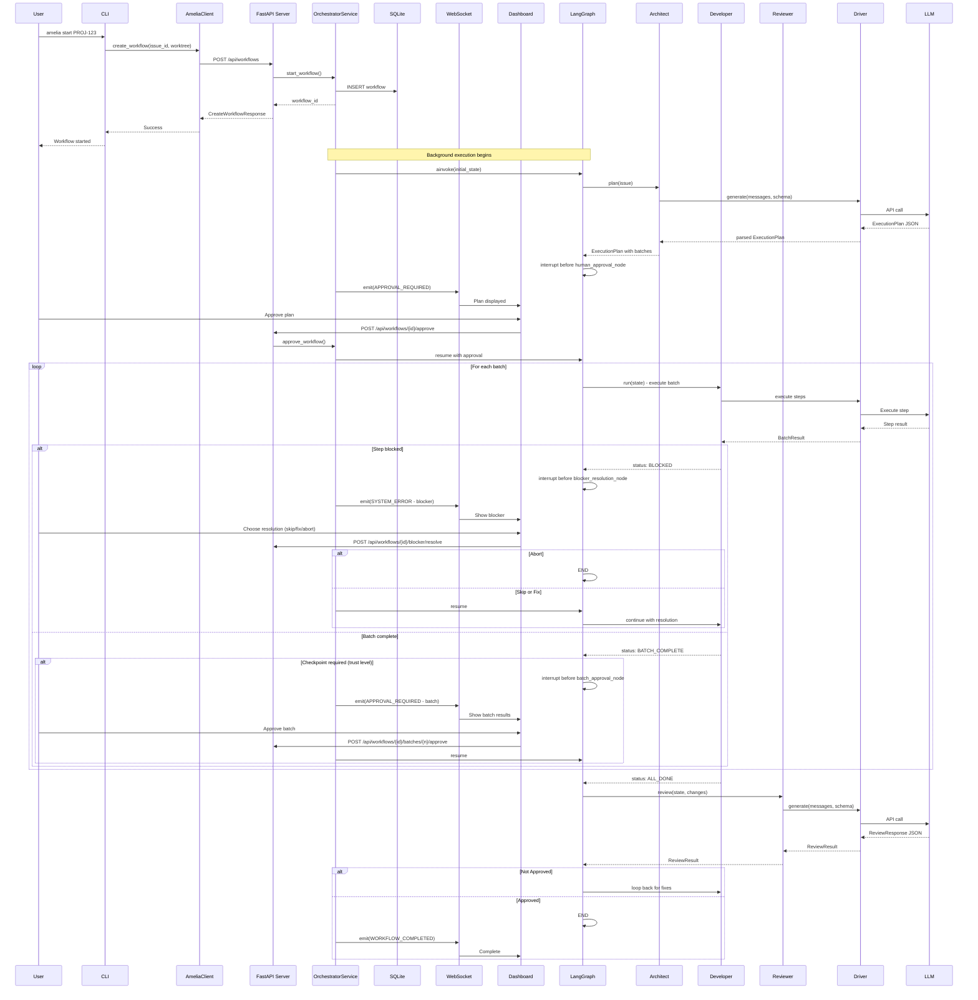
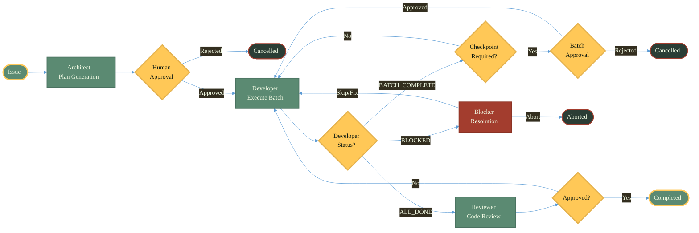

# Architecture & Data Flow

This document provides a technical deep dive into Amelia's architecture, component interactions, and data flow.

## System Overview



## Component Breakdown

| Layer | Location | Purpose | Key Abstractions |
|-------|----------|---------|------------------|
| **Core** | `amelia/core/` | LangGraph orchestrator, state management, shared types | `ExecutionState`, `TaskDAG`, `Profile`, `Issue` |
| **Agents** | `amelia/agents/` | Specialized AI agents for planning, execution, and review | `Architect`, `Developer`, `Reviewer` |
| **Drivers** | `amelia/drivers/` | LLM abstraction supporting API and CLI backends | `DriverInterface`, `DriverFactory` |
| **Trackers** | `amelia/trackers/` | Issue source abstraction for different platforms | `BaseTracker` (Jira, GitHub) |
| **Tools** | `amelia/tools/` | Secure command and file operations with 4-layer security | `SafeShellExecutor`, `SafeFileWriter` |
| **Client** | `amelia/client/` | CLI commands and REST client for server communication | `AmeliaClient`, Typer commands |
| **Server** | `amelia/server/` | FastAPI backend with WebSocket events, SQLite persistence | `OrchestratorService`, `EventBus`, `WorkflowRepository` |

See [File Structure Reference](#file-structure-reference) for detailed file listings.

## Data Flow: `amelia start PROJ-123`

Amelia uses a server-based execution architecture.

### Server-Based Flow

This is the production architecture where CLI commands communicate with a background server via REST API.

#### 1. CLI → Client (`client/cli.py`)

```python
# Detect git worktree context
worktree_path, worktree_name = get_worktree_context()

# Create API client
client = AmeliaClient(base_url="http://localhost:8420")

# Send create workflow request
response = await client.create_workflow(
    issue_id="PROJ-123",
    worktree_path=worktree_path,
    profile="work"
)
# Returns: CreateWorkflowResponse(id="uuid", status="pending")
```

#### 2. Server → OrchestratorService (`server/orchestrator/service.py`)

```python
# Validate worktree (exists, is directory, has .git)
validate_worktree(worktree_path)

# Check concurrency limits (one per worktree, max 5 global)
if worktree_path in active_workflows:
    raise WorkflowConflictError(active_workflow_id)

# Create workflow record in database
workflow = await repository.create_workflow(...)

# Start workflow in background task
asyncio.create_task(run_workflow_with_retry(workflow_id))
```

#### 3. Workflow Execution (LangGraph)

```python
# Load settings and create tracker
settings = load_settings()
profile = settings.profiles[profile_name]
tracker = create_tracker(profile)
issue = tracker.get_issue("PROJ-123")

# Initialize state
initial_state = ExecutionState(profile=profile, issue=issue)

# Run with SQLite checkpointing
checkpointer = AsyncSqliteSaver(db_path)
app = create_orchestrator_graph().compile(checkpointer=checkpointer)
final_state = await app.ainvoke(initial_state, config={"thread_id": workflow_id})
```

#### 4. Real-Time Events → WebSocket → Dashboard

```python
# Emit events at each stage
await event_bus.publish(WorkflowEvent(
    workflow_id=workflow_id,
    event_type=EventType.STAGE_STARTED,
    agent="architect",
    message="Generating implementation plan"
))

# WebSocket broadcasts to subscribed clients
await connection_manager.broadcast(event, workflow_id)

# Dashboard receives and displays updates
```

#### 5. Human Approval Gate

```python
# Workflow blocks at human_approval_node
await event_bus.publish(WorkflowEvent(
    event_type=EventType.APPROVAL_REQUIRED,
    message="Plan ready for review"
))

# User runs: amelia approve
await client.approve_workflow(workflow_id)

# Server resumes workflow
await orchestrator_service.approve_workflow(workflow_id)
```

### Orchestrator Nodes (LangGraph)

#### Node: `architect_node`

```python
# Get driver for LLM communication
driver = DriverFactory.get_driver(profile.driver)

# Generate plan with structured output (TDD-focused)
architect = Architect(driver)
plan_output = await architect.plan(issue, design=optional_design)
# Returns: PlanOutput(task_dag=TaskDAG, markdown_path=Path)

# Update state
state.plan = plan_output.task_dag
```

#### Node: `human_approval_node`

```python
# In server mode: emit event and block (LangGraph interrupt)
if server_mode:
    emit_event(EventType.APPROVAL_REQUIRED)
    return interrupt(state)  # Blocks until approve/reject

# In CLI mode: prompt user directly
approved = typer.confirm("Approve this plan?")
state.human_approved = approved
```

#### Node: `developer_node` (may loop)

```python
# Find tasks with met dependencies
ready_tasks = state.plan.get_ready_tasks()

# Execute tasks (structured or agentic mode)
developer = Developer(driver, execution_mode=profile.execution_mode)
for task in ready_tasks:
    result = await developer.execute_task(task, cwd=worktree_path)
    task.status = "completed" if result["status"] == "completed" else "failed"

# Loop back if pending tasks remain, else proceed to reviewer
```

#### Node: `reviewer_node`

```python
# Get code changes
code_changes = state.code_changes_for_review or get_git_diff("HEAD")

# Run review (single or competitive strategy)
reviewer = Reviewer(driver)
review_result = await reviewer.review(state, code_changes)
# Competitive: parallel Security/Performance/Usability reviews, aggregated

state.review_results.append(review_result)
# If not approved → back to developer_node for fixes
# If approved → END
```

## Sequence Diagram

### Server-Based Architecture with Batch Checkpoints



## Key Types

### Configuration Types

#### Profile

```python
class Profile(BaseModel):
    name: str
    driver: DriverType                             # "api:openai" | "cli:claude" | "cli" | "api"
    tracker: TrackerType = "none"                  # "jira" | "github" | "none"
    strategy: StrategyType = "single"              # "single" | "competitive"
    execution_mode: ExecutionMode = "structured"   # "structured" | "agentic"
    plan_output_dir: str = "docs/plans"
    working_dir: str | None = None
    retry: RetryConfig = Field(default_factory=RetryConfig)
    trust_level: TrustLevel = TrustLevel.STANDARD  # NEW: "paranoid" | "standard" | "autonomous"
    batch_checkpoint_enabled: bool = True          # NEW: Enable/disable batch checkpoints
```

#### TrustLevel

```python
class TrustLevel(StrEnum):
    """How much autonomy the Developer gets."""
    PARANOID = "paranoid"    # Approve every batch
    STANDARD = "standard"    # Approve batches (default)
    AUTONOMOUS = "autonomous" # Auto-approve low/medium, stop only for high-risk
```

#### DeveloperStatus

```python
class DeveloperStatus(StrEnum):
    """Developer agent execution status."""
    EXECUTING = "executing"       # Actively executing batch
    BATCH_COMPLETE = "batch_complete"  # Batch done, ready for checkpoint
    BLOCKED = "blocked"           # Blocked, needs human intervention
    ALL_DONE = "all_done"         # All batches completed
```

#### RetryConfig

```python
class RetryConfig(BaseModel):
    max_retries: int = Field(default=3, ge=0, le=10)
    base_delay: float = Field(default=1.0, ge=0.1, le=30.0)
    max_delay: float = Field(default=60.0, ge=1.0, le=300.0)
```

#### ServerConfig

```python
class ServerConfig(BaseSettings):
    model_config = SettingsConfigDict(env_prefix="AMELIA_")

    host: str = "127.0.0.1"
    port: int = Field(default=8420, ge=1, le=65535)
    database_path: Path = Path("~/.amelia/amelia.db")
    log_retention_days: int = 30
    log_retention_max_events: int = 100_000
    websocket_idle_timeout_seconds: float = 300.0
    workflow_start_timeout_seconds: float = 60.0
    max_concurrent: int = 5
```

### Domain Types

#### Issue

```python
class Issue(BaseModel):
    id: str
    title: str
    description: str
    status: str = "open"
```

#### Design

```python
class Design(BaseModel):
    title: str
    goal: str
    architecture: str
    tech_stack: list[str]
    components: list[str]
    data_flow: str | None = None
    error_handling: str | None = None
    testing_strategy: str | None = None
    relevant_files: list[str] = Field(default_factory=list)
    conventions: str | None = None
    raw_content: str
```

### Task Types

#### PlanStep

```python
class PlanStep(BaseModel):
    """Atomic unit of work (frozen, immutable)."""
    model_config = ConfigDict(frozen=True)

    id: str
    description: str
    action_type: ActionType  # "code" | "command" | "validation" | "manual"
    file_path: str | None = None
    code_change: str | None = None
    command: str | None = None
    cwd: str | None = None
    fallback_commands: tuple[str, ...] = ()
    expect_exit_code: int = 0
    expected_output_pattern: str | None = None
    validation_command: str | None = None
    risk_level: RiskLevel = "medium"  # "low" | "medium" | "high"
    estimated_minutes: int = 2
    requires_human_judgment: bool = False
    depends_on: tuple[str, ...] = ()
    is_test_step: bool = False
    validates_step: str | None = None
```

#### ExecutionBatch

```python
class ExecutionBatch(BaseModel):
    """Group of steps executed before checkpoint (frozen)."""
    model_config = ConfigDict(frozen=True)

    batch_number: int
    steps: tuple[PlanStep, ...]
    risk_summary: RiskLevel  # "low" | "medium" | "high"
    description: str = ""
```

#### ExecutionPlan

```python
class ExecutionPlan(BaseModel):
    """Complete plan with batches (frozen)."""
    model_config = ConfigDict(frozen=True)

    goal: str
    batches: tuple[ExecutionBatch, ...]
    total_estimated_minutes: int
    tdd_approach: bool = True
```

### Blocker & Result Types

#### BlockerReport

```python
class BlockerReport(BaseModel):
    """Captured when execution blocks (frozen)."""
    model_config = ConfigDict(frozen=True)

    step_id: str
    step_description: str
    blocker_type: BlockerType  # command_failed | validation_failed | needs_judgment | ...
    error_message: str
    attempted_actions: tuple[str, ...]
    suggested_resolutions: tuple[str, ...]
```

#### BatchResult

```python
class BatchResult(BaseModel):
    """Result of batch execution (frozen)."""
    model_config = ConfigDict(frozen=True)

    batch_number: int
    status: BatchStatus  # "complete" | "blocked" | "partial"
    completed_steps: tuple[StepResult, ...]
    blocker: BlockerReport | None = None
```

#### BatchApproval

```python
class BatchApproval(BaseModel):
    """Human approval decision for a batch (frozen)."""
    model_config = ConfigDict(frozen=True)

    batch_number: int
    approved: bool
    feedback: str | None = None
    approved_at: datetime
```

#### GitSnapshot

```python
class GitSnapshot(BaseModel):
    """Git state before batch for revert capability (frozen)."""
    model_config = ConfigDict(frozen=True)

    head_commit: str
    dirty_files: tuple[str, ...] = ()
    stash_ref: str | None = None
```

### State Types

#### ExecutionState

```python
class ExecutionState(BaseModel):
    profile: Profile
    issue: Issue | None = None
    design: Design | None = None
    execution_plan: ExecutionPlan | None = None      # NEW: Batched execution plan
    current_batch_index: int = 0                     # NEW: Current batch (0-based)
    batch_results: Annotated[list[BatchResult], operator.add] = []  # NEW: Completed batches
    developer_status: DeveloperStatus = DeveloperStatus.EXECUTING   # NEW: Agent status
    current_blocker: BlockerReport | None = None     # NEW: Active blocker
    blocker_resolution: str | None = None            # NEW: Human's resolution
    batch_approvals: Annotated[list[BatchApproval], operator.add] = []  # NEW: Approval history
    skipped_step_ids: Annotated[set[str], merge_sets] = set()  # NEW: Skipped steps
    git_snapshot_before_batch: GitSnapshot | None = None  # NEW: For revert
    human_approved: bool | None = None
    human_feedback: str | None = None
    last_review: ReviewResult | None = None
    code_changes_for_review: str | None = None
    driver_session_id: str | None = None
    workflow_status: Literal["running", "completed", "failed", "aborted"] = "running"
    plan_only: bool = False                          # NEW: Stop after planning
```

#### ReviewResult

```python
class ReviewResult(BaseModel):
    reviewer_persona: str          # "General", "Security", "Performance", "Usability"
    approved: bool
    comments: list[str]
    severity: Severity             # "low" | "medium" | "high" | "critical"
```

#### AgentMessage

```python
class AgentMessage(BaseModel):
    role: str                      # "system" | "assistant" | "user"
    content: str
    tool_calls: list[Any] | None = None
```

### Server Types

#### WorkflowEvent

```python
class WorkflowEvent(BaseModel):
    id: str                        # UUID
    workflow_id: str
    sequence: int                  # Monotonic counter for ordering
    timestamp: datetime
    agent: str                     # "architect" | "developer" | "reviewer" | "system"
    event_type: EventType          # See EventType enum below
    message: str
    data: dict[str, Any] | None = None
    correlation_id: str | None = None
```

#### EventType (Enum)

```python
class EventType(str, Enum):
    WORKFLOW_STARTED = "workflow_started"
    WORKFLOW_COMPLETED = "workflow_completed"
    WORKFLOW_FAILED = "workflow_failed"
    WORKFLOW_CANCELLED = "workflow_cancelled"
    STAGE_STARTED = "stage_started"
    STAGE_COMPLETED = "stage_completed"
    APPROVAL_REQUIRED = "approval_required"
    APPROVAL_GRANTED = "approval_granted"
    APPROVAL_REJECTED = "approval_rejected"
    FILE_CREATED = "file_created"
    FILE_MODIFIED = "file_modified"
    FILE_DELETED = "file_deleted"
    REVIEW_REQUESTED = "review_requested"
    REVIEW_COMPLETED = "review_completed"
    REVISION_REQUESTED = "revision_requested"
    SYSTEM_ERROR = "system_error"
    SYSTEM_WARNING = "system_warning"
```

#### TokenUsage

```python
class TokenUsage(BaseModel):
    id: str
    workflow_id: str
    agent: str
    model: str = "claude-sonnet-4-20250514"
    input_tokens: int
    output_tokens: int
    cache_read_tokens: int = 0
    cache_creation_tokens: int = 0
    cost_usd: float | None = None
    timestamp: datetime
```

## Orchestrator Nodes

The LangGraph state machine consists of these nodes:

| Node | Function | Next |
|------|----------|------|
| `architect_node` | Calls `Architect.plan()` to generate `ExecutionPlan` with batches | `human_approval_node` |
| `human_approval_node` | Plan approval gate (LangGraph interrupt) | `developer_node` (approved) or END (rejected) |
| `developer_node` | Executes current batch via `Developer.run()` | `batch_approval_node` (checkpoint), `blocker_resolution_node` (blocked), or `reviewer_node` (all done) |
| `batch_approval_node` | Batch checkpoint gate (trust-level dependent) | `developer_node` (approved) or END (rejected) |
| `blocker_resolution_node` | Handles blocked execution (skip/fix/abort) | `developer_node` (skip/fix) or END (abort) |
| `reviewer_node` | Calls `Reviewer.review()` | `developer_node` (not approved) or END (approved) |

### Orchestrator Flow



## Conditional Edges

```python
# From human_approval_node
def route_after_approval(state):
    if state.human_approved:
        return "developer_node"
    return END

# From developer_node (batch execution model)
def route_after_developer(state):
    match state.developer_status:
        case DeveloperStatus.EXECUTING:
            return "developer_node"  # Continue current batch
        case DeveloperStatus.BATCH_COMPLETE:
            if should_checkpoint(state):
                return "batch_approval_node"
            return "developer_node"  # Skip checkpoint, next batch
        case DeveloperStatus.BLOCKED:
            return "blocker_resolution_node"
        case DeveloperStatus.ALL_DONE:
            return "reviewer_node"

# From batch_approval_node
def route_batch_approval(state):
    if state.human_approved:
        return "developer_node"  # Next batch
    return END  # Rejected

# From blocker_resolution_node
def route_blocker_resolution(state):
    if state.blocker_resolution in ("abort", "abort_revert"):
        return END
    return "developer_node"  # Skip or fix

# From reviewer_node
def route_after_review(state):
    if state.review_results[-1].approved:
        return END
    return "developer_node"  # Fix issues
```

## Security Architecture

### Command Execution Security

The `SafeShellExecutor` (`amelia/tools/safe_shell.py`) implements a 4-layer security model:

| Layer | Check | Purpose |
|-------|-------|---------|
| 1. Metacharacters | Blocks `\|`, `;`, `&`, `$`, backticks, `>`, `<` | Prevents shell injection |
| 2. Blocklist | Blocks `sudo`, `su`, `mkfs`, `dd`, `reboot`, etc. | Prevents privilege escalation |
| 3. Dangerous Patterns | Regex detection of `rm -rf /`, `curl \| sh`, etc. | Prevents destructive commands |
| 4. Strict Allowlist | Optional whitelist of ~50 safe commands | High-security mode |

```python
# Example: Command blocked at layer 1
await executor.execute("cat file.txt | grep error")  # ShellInjectionError

# Example: Command blocked at layer 2
await executor.execute("sudo apt install foo")  # BlockedCommandError

# Example: Strict mode
executor = SafeShellExecutor(strict_mode=True)
await executor.execute("git status")  # OK (in allowlist)
await executor.execute("curl https://...")  # CommandNotAllowedError
```

### File Write Security

The `SafeFileWriter` (`amelia/tools/safe_file.py`) protects against path traversal:

- **Path Resolution**: All paths resolved to absolute before validation
- **Directory Restriction**: Writes only allowed within specified directories (default: cwd)
- **Symlink Detection**: Detects and blocks symlink escape attacks at every path component
- **Parent Creation**: Auto-creates parent directories within allowed bounds

```python
# Example: Path traversal blocked
await writer.write("../../../etc/passwd", content)  # PathTraversalError

# Example: Symlink escape blocked
# If /tmp/escape -> /etc, then:
await writer.write("/allowed/tmp/escape/passwd", content)  # PathTraversalError
```

### Exception Hierarchy

```
AmeliaError (base)
├── ConfigurationError          # Missing/invalid configuration
├── SecurityError               # Base for security violations
│   ├── DangerousCommandError   # Dangerous pattern detected
│   ├── BlockedCommandError     # Command in blocklist
│   ├── ShellInjectionError     # Shell metacharacters detected
│   ├── PathTraversalError      # Path escape attempt
│   └── CommandNotAllowedError  # Not in strict allowlist
└── AgenticExecutionError       # Agentic mode failures
```

## Observability

### Event System

Amelia uses an event-driven architecture for real-time observability:

```
Orchestrator → EventBus → WebSocket → Dashboard
                  ↓
              Database (events table)
```

**Event Types**: 17 distinct event types covering workflow lifecycle, file operations, and review cycles.

### Database Schema

```sql
-- Workflow state persistence
CREATE TABLE workflows (
    id TEXT PRIMARY KEY,
    issue_id TEXT NOT NULL,
    worktree_path TEXT NOT NULL,
    status TEXT DEFAULT 'pending',  -- pending/running/completed/failed/cancelled
    started_at TIMESTAMP,
    completed_at TIMESTAMP,
    failure_reason TEXT,
    state_json TEXT NOT NULL
);

-- Append-only event log
CREATE TABLE events (
    id TEXT PRIMARY KEY,
    workflow_id TEXT REFERENCES workflows(id),
    sequence INTEGER NOT NULL,      -- Monotonic ordering
    timestamp TIMESTAMP DEFAULT CURRENT_TIMESTAMP,
    agent TEXT NOT NULL,
    event_type TEXT NOT NULL,
    message TEXT NOT NULL,
    data_json TEXT,
    correlation_id TEXT             -- Links related events
);

-- Token usage tracking
CREATE TABLE token_usage (
    id TEXT PRIMARY KEY,
    workflow_id TEXT REFERENCES workflows(id),
    agent TEXT NOT NULL,
    model TEXT DEFAULT 'claude-sonnet-4-20250514',
    input_tokens INTEGER NOT NULL,
    output_tokens INTEGER NOT NULL,
    cache_read_tokens INTEGER DEFAULT 0,
    cache_creation_tokens INTEGER DEFAULT 0,
    cost_usd REAL,
    timestamp TIMESTAMP DEFAULT CURRENT_TIMESTAMP
);
```

### Health Endpoints

| Endpoint | Purpose |
|----------|---------|
| `GET /api/health/live` | Kubernetes liveness probe |
| `GET /api/health/ready` | Kubernetes readiness probe |
| `GET /api/health` | Detailed health with metrics (uptime, memory, CPU, active workflows) |

### Logging

Loguru-based logging with custom Amelia dashboard colors:

```python
from loguru import logger

logger.debug("Low-level details")    # Sage muted
logger.info("General information")   # Blue
logger.success("Operation succeeded") # Sage green
logger.warning("Potential issue")    # Gold
logger.error("Error occurred")       # Rust red
```

### Log Retention

The `LogRetentionService` runs during graceful shutdown:
- Deletes events older than `AMELIA_LOG_RETENTION_DAYS` (default: 30)
- Enforces `AMELIA_LOG_RETENTION_MAX_EVENTS` per workflow (default: 100,000)

## API Endpoints

### Workflow Management

| Method | Endpoint | Purpose |
|--------|----------|---------|
| POST | `/api/workflows` | Create new workflow |
| GET | `/api/workflows` | List workflows (with filtering) |
| GET | `/api/workflows/active` | List active workflows |
| GET | `/api/workflows/{id}` | Get workflow details |
| POST | `/api/workflows/{id}/approve` | Approve plan |
| POST | `/api/workflows/{id}/reject` | Reject plan |
| POST | `/api/workflows/{id}/cancel` | Cancel workflow |

### Batch Execution (New)

| Method | Endpoint | Purpose |
|--------|----------|---------|
| POST | `/api/workflows/{id}/batches/{n}/approve` | Approve completed batch |
| POST | `/api/workflows/{id}/blocker/resolve` | Resolve execution blocker |

### Request Models

#### CreateWorkflowRequest
```python
class CreateWorkflowRequest(BaseModel):
    issue_id: str
    worktree_path: str
    worktree_name: str | None = None
    profile: str | None = None
    plan_only: bool = False  # NEW: Stop after planning
```

#### BlockerResolutionRequest
```python
class BlockerResolutionRequest(BaseModel):
    action: Literal["skip", "retry", "abort", "abort_revert", "fix"]
    feedback: str | None = None  # Fix instructions if action="fix"
```

### Response Models

#### WorkflowDetailResponse (Enhanced)
```python
class WorkflowDetailResponse(BaseModel):
    id: str
    issue_id: str
    worktree_path: str
    status: str
    started_at: datetime | None
    completed_at: datetime | None
    # Batch execution fields (NEW)
    execution_plan: dict | None = None
    current_batch_index: int = 0
    batch_results: list[dict] = []
    developer_status: str | None = None
    current_blocker: dict | None = None
    batch_approvals: list[dict] = []
```

### Error Codes

| Code | Exception | Description |
|------|-----------|-------------|
| 400 | `InvalidWorktreeError` | Invalid worktree path |
| 404 | `WorkflowNotFoundError` | Workflow not found |
| 409 | `WorkflowConflictError` | Workflow already active for worktree |
| 422 | `InvalidStateError` | Workflow not in correct state for action |
| 429 | `ConcurrencyLimitError` | Max concurrent workflows reached |

### WebSocket Events

Connect to `/ws/events/{workflow_id}` for real-time updates:

```typescript
// Event types
type EventType =
  | "workflow_started"
  | "workflow_completed"
  | "workflow_failed"
  | "workflow_cancelled"
  | "stage_started"
  | "stage_completed"
  | "approval_required"
  | "approval_granted"
  | "approval_rejected"
  | "system_error";  // Includes blocker notifications
```

## Key Design Decisions

### Why the Driver Abstraction?

Enterprise environments often prohibit direct API calls due to data retention policies. The CLI driver wraps existing approved tools (like `claude` CLI) that inherit SSO authentication and comply with policies. Users can switch between API (fast prototyping) and CLI (enterprise compliance) without code changes.

### Why Separate Agents Instead of One Big Prompt?

1. **Specialization**: Each agent has focused system prompts, leading to better outputs
2. **Token efficiency**: Only relevant context is passed to each agent
3. **Modularity**: Easy to swap implementations (e.g., different review strategies)
4. **Debuggability**: Clear separation makes it easier to trace issues

### Why pydantic-ai for the API Driver?

1. **Structured outputs**: Forces LLM to return valid JSON matching Pydantic schemas
2. **Type safety**: Catches schema mismatches at runtime
3. **Cleaner code**: No manual JSON parsing or validation

### Why LangGraph for Orchestration?

1. **Built for cycles**: Supports developer ↔ reviewer loop naturally
2. **State management**: Built-in state tracking
3. **Checkpointing**: Resumable workflows with SQLite persistence
4. **Conditional edges**: Clean decision logic
5. **Interrupts**: Supports human-in-the-loop approval gates

### Why a Server Architecture?

1. **Decoupled execution**: CLI returns immediately; workflow runs in background
2. **Dashboard integration**: WebSocket enables real-time UI updates
3. **Workflow management**: Approve, reject, cancel from any terminal or browser
4. **Concurrency control**: Prevents multiple workflows on same worktree
5. **Persistence**: SQLite stores workflow state, events, and token usage
6. **Observability**: Event stream enables monitoring and debugging

## File Structure Reference

```
amelia/
├── agents/
│   ├── __init__.py
│   ├── architect.py          # TaskDAG generation with TDD focus
│   ├── developer.py          # Task execution (structured/agentic modes)
│   └── reviewer.py           # Code review (single/competitive strategies)
├── client/
│   ├── __init__.py
│   ├── api.py                # AmeliaClient REST client
│   ├── cli.py                # CLI commands: start, approve, reject, status, cancel
│   └── git.py                # get_worktree_context() for git detection
├── core/
│   ├── __init__.py
│   ├── constants.py          # Security constants: blocked commands, patterns
│   ├── exceptions.py         # AmeliaError hierarchy
│   ├── orchestrator.py       # LangGraph state machine
│   ├── state.py              # ExecutionState, TaskDAG, Task, etc.
│   └── types.py              # Profile, Issue, Settings, Design, RetryConfig
├── drivers/
│   ├── api/
│   │   ├── __init__.py
│   │   └── openai.py         # OpenAI via pydantic-ai
│   ├── cli/
│   │   ├── __init__.py
│   │   ├── base.py           # CliDriver base with retry logic
│   │   └── claude.py         # Claude CLI wrapper with agentic mode
│   ├── __init__.py
│   ├── base.py               # DriverInterface protocol
│   └── factory.py            # DriverFactory
├── server/
│   ├── database/
│   │   ├── __init__.py
│   │   ├── connection.py     # Async SQLite wrapper, schema init
│   │   └── repository.py     # WorkflowRepository CRUD operations
│   ├── events/
│   │   ├── __init__.py
│   │   ├── bus.py            # EventBus pub/sub
│   │   └── connection_manager.py  # WebSocket client management
│   ├── lifecycle/
│   │   ├── __init__.py
│   │   ├── retention.py      # LogRetentionService
│   │   └── server.py         # Server startup/shutdown
│   ├── models/
│   │   ├── __init__.py
│   │   ├── events.py         # WorkflowEvent, EventType
│   │   ├── requests.py       # CreateWorkflowRequest, RejectRequest
│   │   ├── responses.py      # WorkflowResponse, ActionResponse
│   │   └── tokens.py         # TokenUsage
│   ├── orchestrator/
│   │   ├── __init__.py
│   │   └── service.py        # OrchestratorService
│   ├── routes/
│   │   ├── __init__.py
│   │   ├── health.py         # Health check endpoints
│   │   ├── websocket.py      # /ws/events WebSocket handler
│   │   └── workflows.py      # /api/workflows REST endpoints
│   ├── __init__.py
│   ├── cli.py                # amelia server command
│   ├── config.py             # ServerConfig with AMELIA_* env vars
│   ├── dev.py                # amelia dev command (server + dashboard)
│   └── main.py               # FastAPI application
├── trackers/
│   ├── __init__.py
│   ├── base.py               # BaseTracker protocol
│   ├── factory.py            # create_tracker()
│   ├── github.py             # GitHub via gh CLI
│   └── jira.py               # Jira REST API
├── tools/
│   ├── __init__.py
│   ├── safe_file.py          # SafeFileWriter with path traversal protection
│   ├── safe_shell.py         # SafeShellExecutor with 4-layer security
│   ├── shell_executor.py     # Backward-compat wrappers
│   └── git_snapshot.py       # GitSnapshot for batch revert capability
├── utils/
│   ├── __init__.py
│   └── design_parser.py      # LLM-powered Design document parser
├── __init__.py
├── config.py                 # load_settings(), validate_profile()
├── logging.py                # Loguru configuration
└── main.py                   # Typer CLI entry point

dashboard/                    # React + TypeScript frontend
├── src/
│   ├── api/
│   │   └── client.ts         # TypeScript API client
│   ├── components/
│   │   ├── flow/
│   │   │   ├── BatchNode.tsx       # Batch container node for React Flow
│   │   │   ├── StepNode.tsx        # Individual step node
│   │   │   └── CheckpointMarker.tsx # Checkpoint approval marker
│   │   ├── BatchStepCanvas.tsx     # React Flow visualization of execution plan
│   │   ├── BlockerResolutionDialog.tsx  # Blocker resolution UI
│   │   └── AgentProgressBar.tsx    # Agent stage progress indicator
│   ├── hooks/                # Custom React hooks
│   ├── pages/                # Route pages
│   └── stores/               # Zustand state stores
├── package.json
└── vite.config.ts
```
